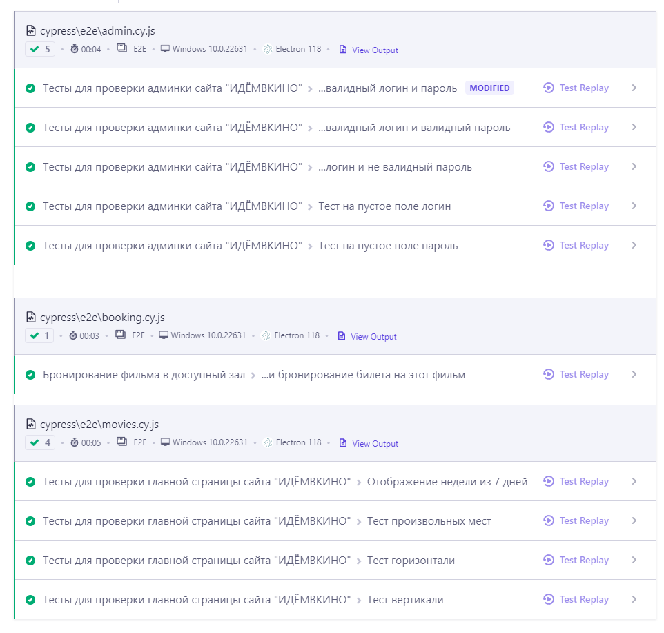

## Домашнее задание к занятию «7.7. Cypress 2»

#### Тесты для приложения ["Идем в кино"](https://qamid.tmweb.ru/)
1. Созданы тесты:
- для проверки корректности отображения главной страницы
- для проверки логина в админку
- для бронирования фильма в доступный зал, название которого получили из админки
2. Данные обо всех селекторах хранятся в фикстурах
3. Подключила проект к [Dashboard](https://cloud.cypress.io/projects/eiggto)

