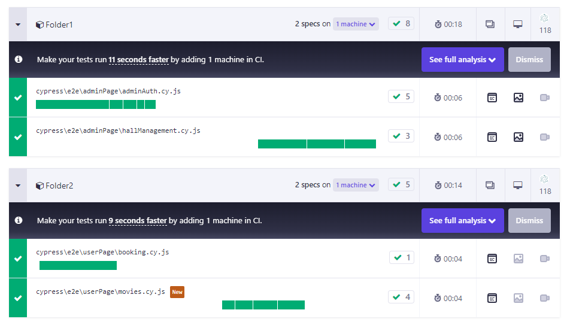

## Домашнее задание к занятию «7.8. CI/CD Jenkins»

#### Задача 1. Cypress. Параллельный запуск тестов

- Организован параллельный запуск для spec-тестов, путем добавления скриптов в `package.json`.

[Dashboard](https://cloud.cypress.io/projects/eiggto/runs/14/specs)

#### Задача 2. Подключение Jenkins
  Реализован запуск тестов в Jenkins локально:  

- Добавлены скрипты и параметры для запуска тестов в трёх разных браузерах.
- Добавлен скрипт и параметр для запуска тестов параллельно, чтобы два разных потока запускались в двух разных браузерах.

- Тесты перемещены в разные папки и к ним добавлены новые тесты
- Добавлен скрипт, который будет запускать тесты в этих двух папках параллельно в двух потоках. Всё из папки 1 — первый поток; всё из папки 2 — второй поток.
- Добавлен новый параметр для запуска тестов из п. 5 в Jenkins.

[Dashboard](https://cloud.cypress.io/projects/eiggto/runs?branches=%5B%5D&committers=%5B%5D&flaky=%5B%5D&page=1&status=%5B%5D&tags=%5B%5D&tagsMatch=ANY&timeRange=%7B%22startDate%22%3A%222023-08-09%22%2C%22endDate%22%3A%222024-08-08%22%7D)
